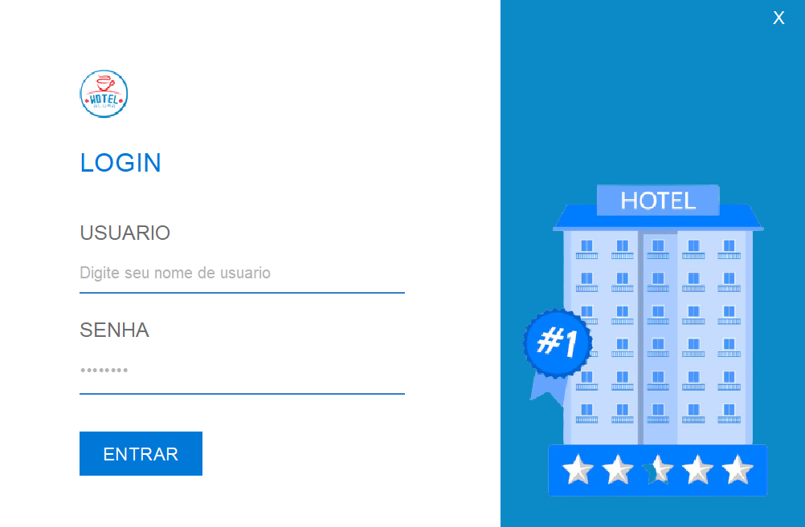
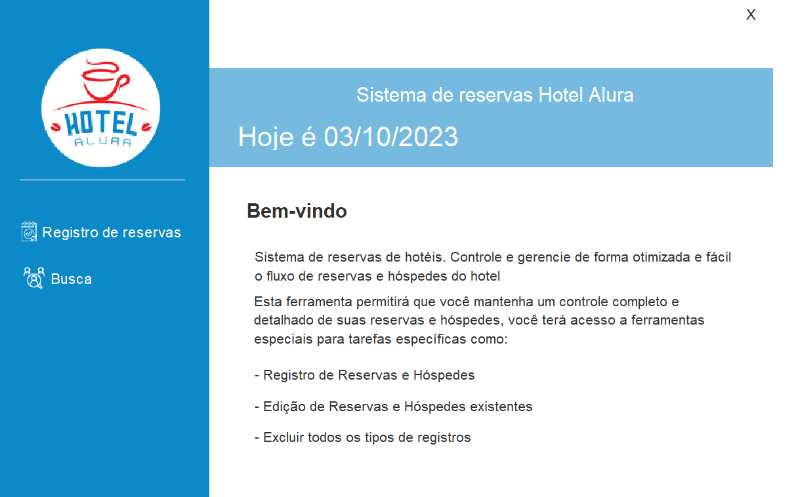
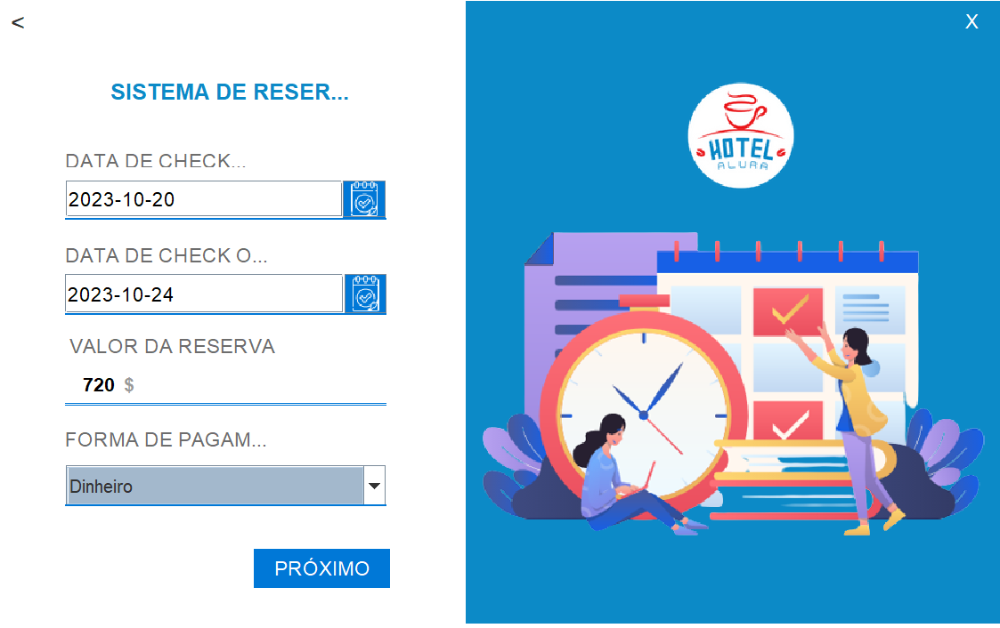
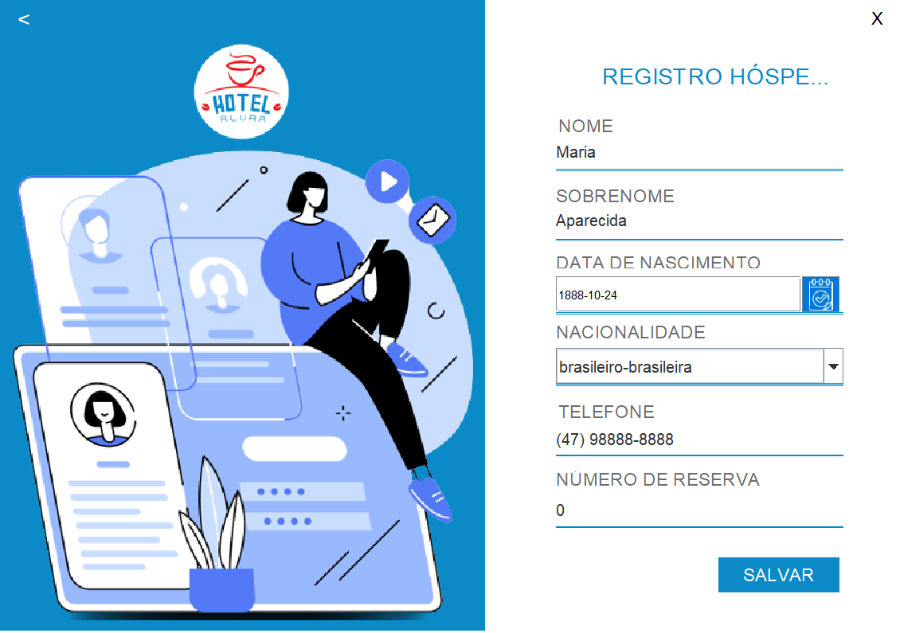
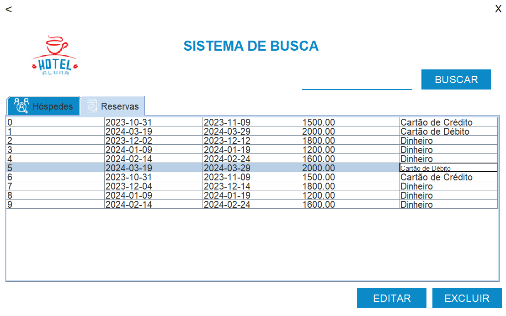
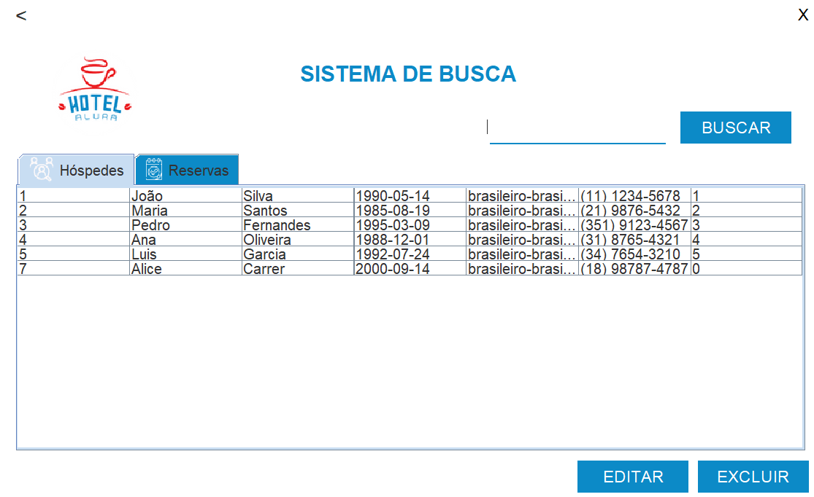

# Challenge ONE | Java | Back-end | Hotel Alura

     

---
## O objetivo do desafio é desenvolver um aplicativo que permita realizar operações CRUD em um banco de dados relacional usando JDBC e Swing.

## 🖥️ Tecnologias Utilizadas:

- Java
- Eclipse
- MySql
- Plugin WindowBuilder

Biblioteca:
-  JCalendar -> download: https://toedter.com/jcalendar/
-  Mchange.c3p0 -> download: https://mvnrepository.com/artifact/com.mchange/c3p0/0.9.5.4
-  Mchange.mchange-commons-java -> download: https://mvnrepository.com/artifact/com.mchange/mchange-commons-java/0.2.16
  
 
 
## 🖥 Interfaces apresentadas:

<h3>Tela Principal</h3>

<h3>Tela de Login</h3>

<h3>Tela Menu Usuário</h3>

Nesta tela o usuário pode escolher se deseja cadastrar uma reserva ou consultar uma reserva já registrada.

<h3>Tela de Cadastro de Reservas</h3>

Aqui o usuário preenche os dados da reserva e o valor é calculado automaticamente, levando em consideração o número de dias entre a data de entrada e saída e o valor da diária que está fixado.

<h3>Tela de Cadastro de Hospedes</h3>

Aqui o usuário preenche os dados do hóspede. O número da reserva não pode ser mudado, pois o valor é resgatado da tabela reservas.

<h3>Tela de Buscas</h3>

Aqui o usuário consulta as reservas cadastradas. O usuário pode editar ou deletar a reserva e também buscar uma reserva pelo ID.

Podem ser feitos os mesmos comandos de editar e deletar,semelhante a tabela reservas.

 

---
## ⚠️ Importante! ⚠️

☕ Use o Java na versão 8 ou superior para ter compatibilidade.
  
📝 Recomendamos utilizar o editor Eclipse para compatibilidade da interface gráfica.   

